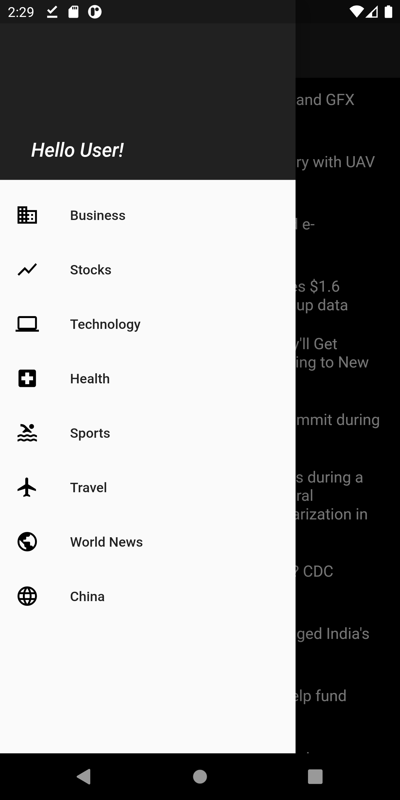

# COVID News

Get latest news regarding the COVID-19 Virus

## Getting Started

Install flutter from flutter.dev to run this app. App is compatible for both Android and iOS.

## Note

If packages in pubspec.yaml are old, do update manually from pub.dev. Get your API Key from newsapi.org. And do substitute the API Keys in the constant.dart and in the url in newsfeed.dart

```
static String key ="ENTER YOUR API KEY";
```
In newsfeed.dart, substitute with the API KEY value or use the String key instead.
```
url = Constant.base_url + "top-headlines?country=us&category=business&apiKey=YOUR_API_KEY";
```
or

```
url = Constant.base_url + "top-headlines?country=us&category=business&apiKey=key";
```

## Screenshots
  

